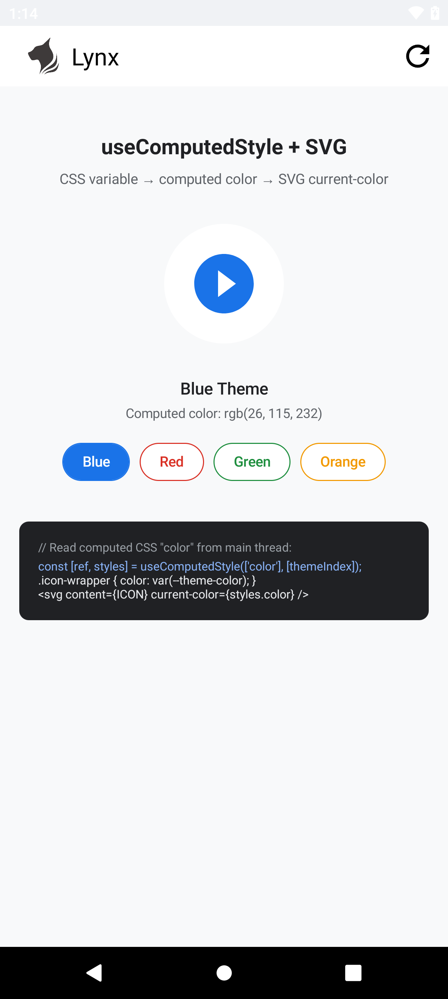
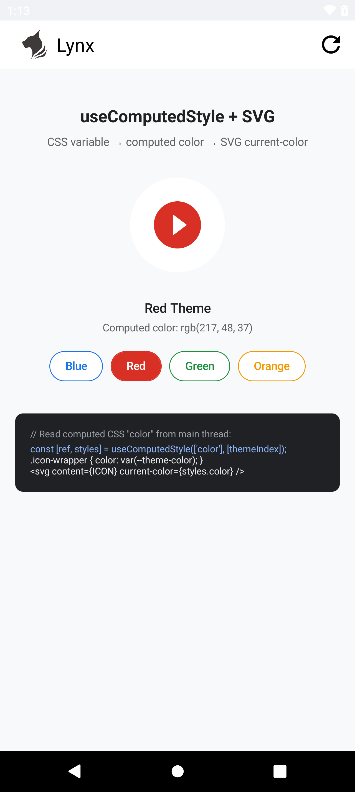
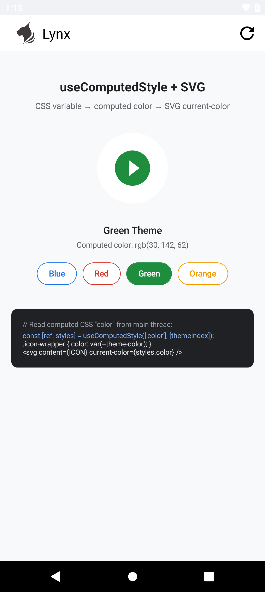
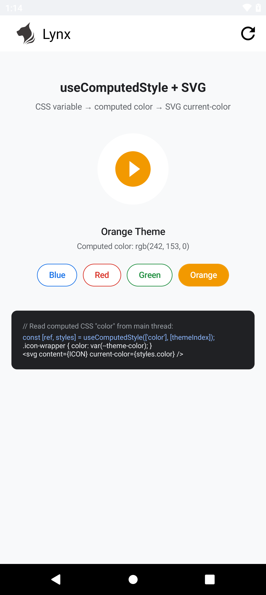

# useComputedStyle

`useComputedStyle` 从主线程元素读取已解析的 CSS 属性值，并将结果返回后台（React）线程。它适用于原生元素属性只接受普通值、而这个值来自 CSS 自定义属性的场景。

## 使用要求

- `element.getComputedStyleProperty()` 要求 Lynx SDK 3.5 或更高版本；应用 Bundle 的引擎版本至少应设为 `3.5`。
- 通过内联 `style` 对象动态设置 CSS 自定义属性时，需要开启 `enableCSSInlineVariables: true`。
- 标准 CSS 属性和 `main-thread:ref` 必须位于同一个元素上，不依赖 CSS 继承。

例如：

```ts title="lynx.config.ts"
import { pluginLynxConfig } from "@lynx-js/config-rsbuild-plugin";
import { pluginReactLynx } from "@lynx-js/react-rsbuild-plugin";
import { defineConfig } from "@lynx-js/rspeedy";

export default defineConfig({
  plugins: [
    pluginReactLynx({ engineVersion: "3.5" }),
    pluginLynxConfig({ enableCSSInlineVariables: true }),
  ],
});
```

## 从 CSS 自定义属性到 SVG `current-color`

SVG 组件属性本身不能解析 `var(--theme-color)`。完整的桥接过程如下：

1. ReactLynx 在 ref 元素的内联样式中修改 `--theme-color`。
2. 同一元素通过 CSS 设置 `color: var(--theme-color)`。
3. 元素更新提交后，`useComputedStyle` 在主线程执行 `element.getComputedStyleProperty("color")`。
4. 已解析的字符串返回后台线程，并传给 SVG 的 `current-color` 属性。
5. 未修改的 SVG 内容通过自己的 `fill="currentColor"` 使用该值。

```tsx title="src/App.tsx"
import { useState } from "@lynx-js/react";
import { useComputedStyle } from "@lynx-js/react-use";
import "./App.css";

const ICON = `<svg xmlns="http://www.w3.org/2000/svg" viewBox="0 0 24 24"><path d="M12 2C6.48 2 2 6.48 2 12s4.48 10 10 10 10-4.48 10-10S17.52 2 12 2zm-2 14.5v-9l6 4.5-6 4.5z" fill="currentColor"/></svg>`;

const THEMES = [
  { name: "Blue", color: "#1a73e8" },
  { name: "Red", color: "#d93025" },
  { name: "Green", color: "#1e8e3e" },
  { name: "Orange", color: "#f29900" },
];

export function App() {
  const [themeIndex, setThemeIndex] = useState(0);
  const theme = THEMES[themeIndex];
  const [ref, styles] = useComputedStyle(["color"], [themeIndex]);

  return (
    <view>
      <view
        main-thread:ref={ref}
        className="icon-wrapper"
        style={{ "--theme-color": theme.color } as Record<string, string>}
      >
        <svg
          className="icon"
          content={ICON}
          current-color={styles.color}
          enable-serval-svg={true}
        />
      </view>

      <text>{`Computed color: ${styles.color ?? "(pending)"}`}</text>
      <view
        bindtap={() => setThemeIndex((themeIndex + 1) % THEMES.length)}
      >
        <text>切换主题：{theme.name}</text>
      </view>
    </view>
  );
}
```

```css title="src/App.css"
.icon-wrapper {
  color: var(--theme-color);
  width: 120rpx;
  height: 120rpx;
}

.icon {
  width: 120rpx;
  height: 120rpx;
}
```

本次验证使用的 Android SVG 组件仅在 Serval 渲染路径中重新渲染 `current-color` 更新，因此示例设置了 `enable-serval-svg={true}`。这不会修改 SVG 内容字符串；可见填充仍然来自 `fill="currentColor"`。

## API

```ts
import type { MainThreadRef } from "@lynx-js/react";
import type { MainThread } from "@lynx-js/types";

type UseComputedStyleReturn = [
  ref: MainThreadRef<MainThread.Element | null>,
  styles: Record<string, string>,
];

function useComputedStyle(
  keys: string[],
  deps?: unknown[],
): UseComputedStyleReturn;
```

`keys` 是 kebab-case 格式的 CSS 属性名。将所有可能使结果失效的值传入 `deps`；依赖变化后，Hook 会在 ReactLynx 补丁提交后的下一帧重新执行主线程读取。

```tsx
const [ref, styles] = useComputedStyle(
  ["color", "background-color", "opacity"],
  [themeIndex],
);
// styles.color, styles["background-color"], styles.opacity
```

结果是异步返回的，因此 `styles` 初始值为 `{}`。如果重新读取到的键和值均未变化，Hook 会保留原对象，不触发额外渲染。

## 真机验证

以下截图来自真实 Android 设备，设备使用 Lynx SDK 4.1，应用 Bundle 的目标引擎版本为 3.5。每张图显示的值均来自 `getComputedStyleProperty("color")`，播放按钮圆形的填充色则来自传给 SVG `current-color` 的同一个值。整个过程没有使用父元素继承、内联 `color`、背景色替代证明或 SVG 字符串替换。

| 蓝色 — `rgb(26, 115, 232)` | 红色 — `rgb(217, 48, 37)` |
|---|---|
|  |  |

| 绿色 — `rgb(30, 142, 62)` | 橙色 — `rgb(242, 153, 0)` |
|---|---|
|  |  |
